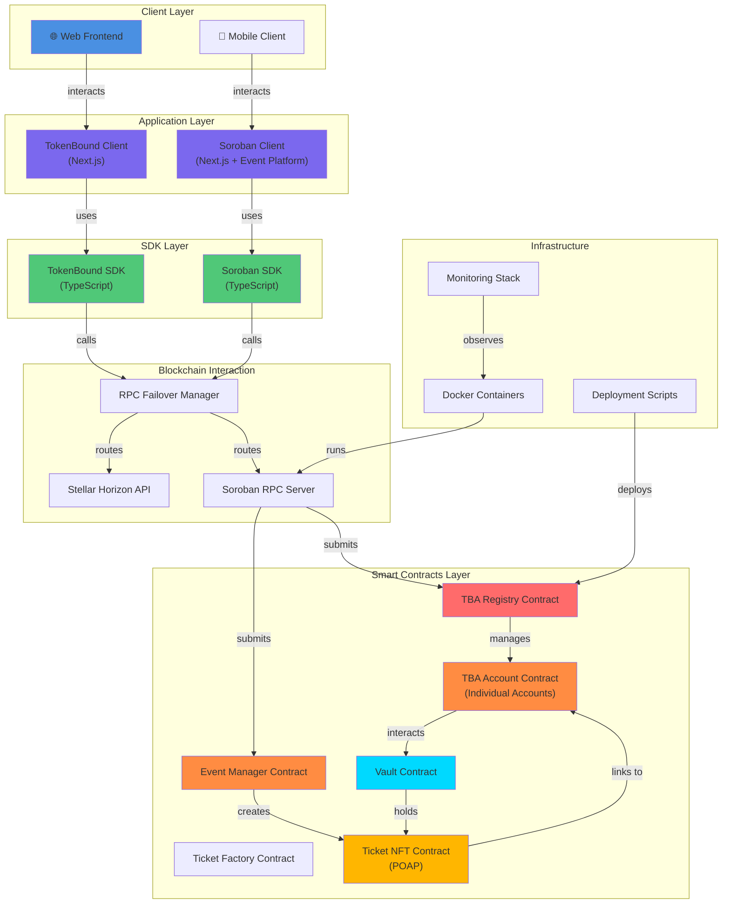
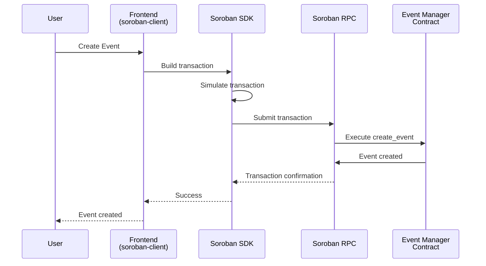
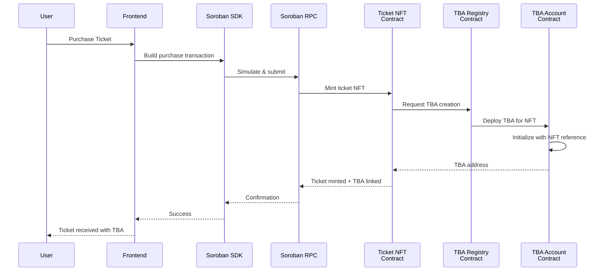
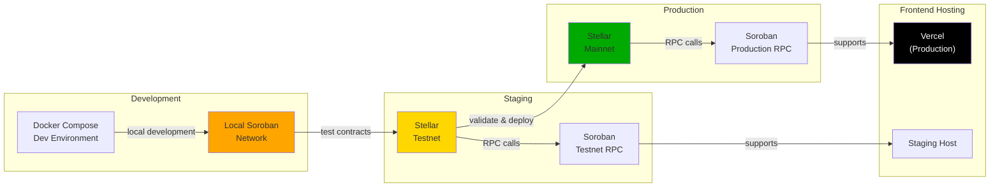

# Tokenbound Implementation - Architecture Documentation

## Table of Contents

1. [System Overview](#system-overview)
2. [High-Level Architecture](#high-level-architecture)
3. [Component Details](#component-details)
4. [Data Flow](#data-flow)
5. [Technology Stack](#technology-stack)
6. [Deployment Architecture](#deployment-architecture)

---

## System Overview

TokenBound is a comprehensive implementation of Token Bound Accounts (TBAs) on the Stellar blockchain. It consists of multiple layers:

- **Smart Contracts Layer**: Soroban smart contracts managing TBA logic
- **SDK Layer**: TypeScript/JavaScript client SDK for interactions
- **Frontend Layer**: Web applications (tokenbound-client, soroban-client)
- **Infrastructure**: Docker, deployment scripts, and CI/CD

---

## High-Level Architecture

---

## Component Details

### 1. **Smart Contracts Layer** (Soroban)

#### TBA Registry Contract

- **Location**: `soroban-contract/contracts/tba_registry/`
- **Purpose**: Factory and directory for TBA accounts
- **Key Features**:
  - Deploys new TBA accounts for NFTs
  - Maintains registry of all TBA accounts
  - Manages account initialization

#### TBA Account Contract

- **Location**: `soroban-contract/contracts/tba_account/`
- **Purpose**: Individual token-bound smart account
- **Key Features**:
  - Owned by current NFT holder
  - Can hold and manage assets
  - Implements custom account interface

#### Event Manager Contract

- **Location**: `soroban-contract/contracts/event_manager/`
- **Purpose**: Manages event lifecycle
- **Key Features**:
  - Creates and manages events
  - Controls event state transitions
  - Links events to ticket contracts

#### Ticket NFT Contract

- **Location**: `soroban-contract/contracts/poap_nft/`
- **Purpose**: Event ticket representation (POAP-style)
- **Key Features**:
  - ERC-20 compatible interface
  - Event-specific metadata
  - Transfer and approval handling

#### Vault Contract

- **Location**: `soroban-contract/contracts/vault/`
- **Purpose**: Asset custody and management
- **Key Features**:
  - Holds and manages tokens
  - Access control via TBA

### 2. **SDK Layer** (TypeScript/JavaScript)

#### `soroban-client/sdk/`

- **TypeScript SDK** for Soroban contract interactions
- Components:
  - `core.ts`: Core SDK client, contract invocation
  - `decoders.ts`: Transaction result decoding
  - `tracer.ts`: Request tracing and debugging
  - `validation.ts`: Input validation
  - Generated contract types from Rust ABIs

#### Key Features:

- Contract invocation (read/write operations)
- Transaction building and simulation
- Error handling and mapping
- Retry logic with configurable policies
- RPC failover support

### 3. **Application Layer** (Frontend)

#### `tokenbound-client`

- **Next.js browser application**
- Purpose: User portal for tokenbound features
- Features:
  - Wallet connection
  - Account management
  - Asset transfers

#### `soroban-client`

- **Next.js + Marketplace Application**
- Purpose: Event platform and marketplace
- Features:
  - Event creation and management
  - Ticket marketplace
  - Analytics dashboard
  - Multi-language support (i18n)

### 4. **Infrastructure**

#### Docker & Deployment

- `docker-compose.yml`: Local development environment
- `soroban-contract/Dockerfile`: Contract compilation
- `client/Dockerfile`: Frontend containerization
- Deployment scripts in `scripts/`

#### Monitoring

- Health checks
- Gas estimation tracking
- Event logging
- Performance metrics

---

## Data Flow

### Event Creation Flow

### Ticket Purchase & TBA Linking

---

## Technology Stack

### Blockchain

- **Network**: Stellar
- **Smart Contract Platform**: Soroban
- **Language**: Rust

### Frontend

- **Framework**: Next.js (React)
- **Styling**: Tailwind CSS
- **State Management**: React Context (and optional Redux)
- **Internationalization**: next-intl
- **Build Tool**: Vite (for some packages)

### Backend/SDK

- **Language**: TypeScript/JavaScript
- **Testing**: Jest
- **HTTP Client**: Fetch API
- **RPC Client**: @stellar/js-stellar-sdk

### Infrastructure

- **Containerization**: Docker
- **Orchestration**: Docker Compose
- **CI/CD**: GitHub Actions
- **Code Quality**: ESLint, Prettier, Rust fmt

---

## Deployment Architecture

---

## Key Design Patterns

### 1. **RPC Failover Pattern**

- Multiple RPC endpoints maintained
- Automatic failover on endpoint failure
- Health checks and retry logic
- Configurable endpoints per environment

### 2. **Event-Driven Architecture**

- Contract events for state changes
- Event indexing for analytics
- Real-time updates via event feeds

### 3. **SDK Abstraction Pattern**

- Separates contract complexity from frontend
- Provides type-safe interfaces
- Handles error mapping and transformation

### 4. **Factory Pattern**

- TBA Registry = Factory for creating TBA accounts
- Ticket Factory = Factory for creating ticket contracts

---

## Recent Additions

- ✅ ERC-20 compatibility layer in POAP NFT contract
- ✅ Gas estimation features for transaction planning
- ✅ Soroban v25 SDK support
- ✅ Enhanced error handling and diagnostics
- ✅ RPC failover manager with health checks
- ✅ Integration test suite for soroban-client
- ✅ Multi-language support (i18n) in web clients

---

## Related Documentation

- [Contract Architecture](./soroban-contract/docs/Architecture.md) - Detailed contract design
- [Deployment Guide](./DEPLOYMENT.md) - Deployment procedures
- [Contributing](./CONTRIBUTING.md) - Development guidelines
- [API Reference](./soroban-client/README.md) - SDK API documentation
