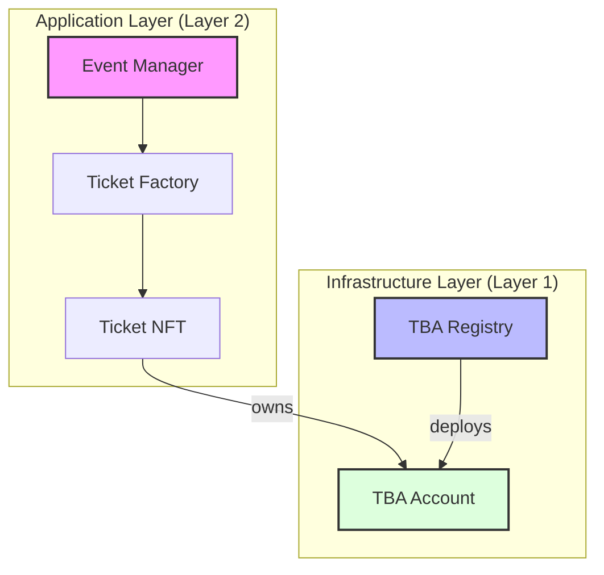
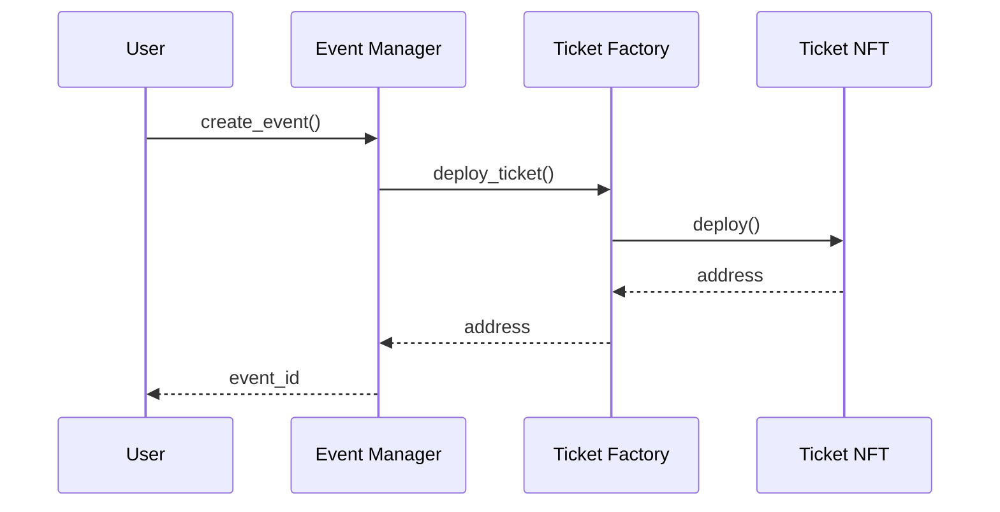
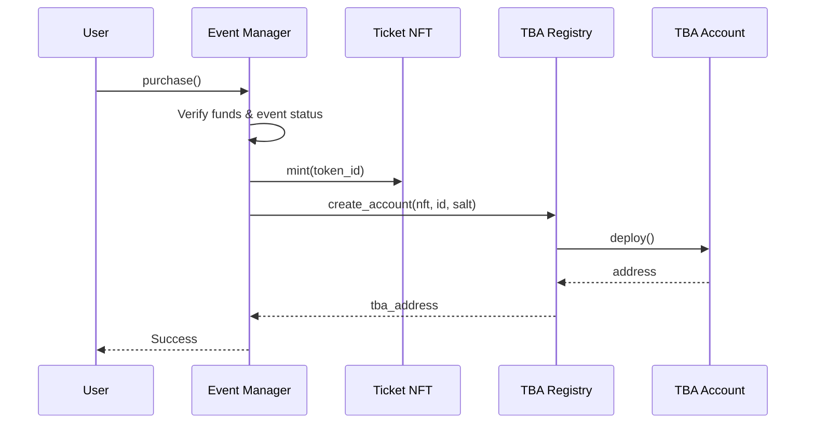
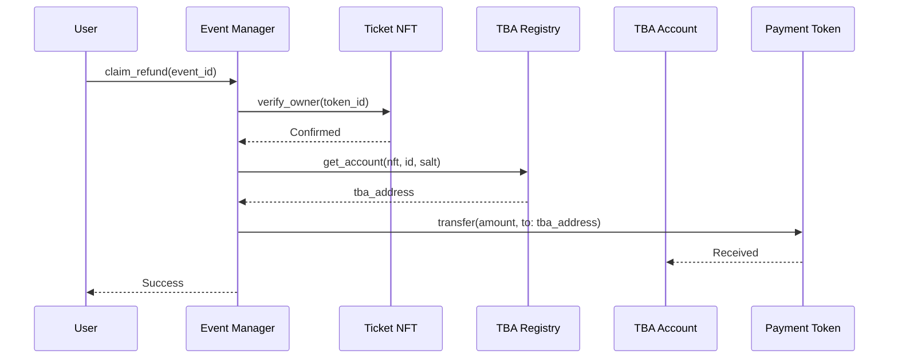

# Architecture Deep Dive

Stellar TBA is a multi-contract system that implements Token Bound Accounts (TBAs) on the Stellar blockchain using Soroban smart contracts.

The architecture consists of two layers:

### Layer 1: TBA Infrastructure
The foundational layer that enables any NFT to have its own account:
- **TBA Account Contract**: Individual smart accounts.
- **TBA Registry Contract**: Factory and directory for TBA accounts.

### Layer 2: Reference Application
A complete event ticketing system that demonstrates TBA capabilities:
- **Event Manager Contract**: Event lifecycle management.
- **Ticket Factory Contract**: NFT contract deployment.
- **Ticket NFT Contract**: Event ticket representation.

## System Overview

---

## Core Components

### 1. TBA Account Contract
**Purpose**: Represents an individual token-bound account owned by a specific NFT.

- One instance per NFT (per salt).
- Controlled by the current NFT owner.
- Uses Soroban's `CustomAccountInterface`.

### 2. TBA Registry Contract
**Purpose**: Factory and directory for creating and tracking TBA accounts.

- Deterministic address calculation.
- Single source of truth for TBA creation.

### 3. Event Manager Contract
**Purpose**: Manages the entire event lifecycle from creation to refunds.

### 4. Ticket NFT Contract
**Purpose**: Represents event tickets as NFTs.

### 5. Ticket Factory Contract
**Purpose**: Deploys isolated Ticket NFT contracts for each event.

---

## Contract Interactions

### Event Creation Flow

### Ticket Purchase Flow

### Refund Claim Flow

> [!TIP]
> **Key Insight**: The refund goes to the TBA account, NOT the user's wallet. If the user transfers the NFT, the new owner gets the refund.

---

## Design Decisions

- **Separate NFT per Event**: Ensuring isolation and scalability.
- **TBA Refunds**: Empowering atomic transfers of tickets and associated assets.
- **One Ticket per User**: Preventing hoarding and ensuring fair distribution.
- **Deterministic Addresses**: Standardizing TBA cross-chain patterns.
